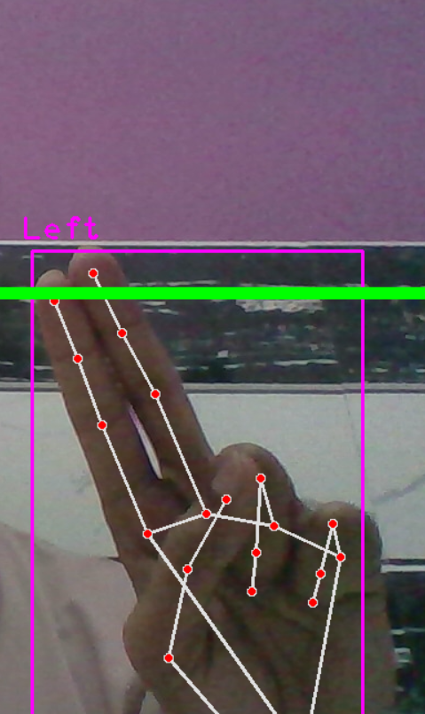
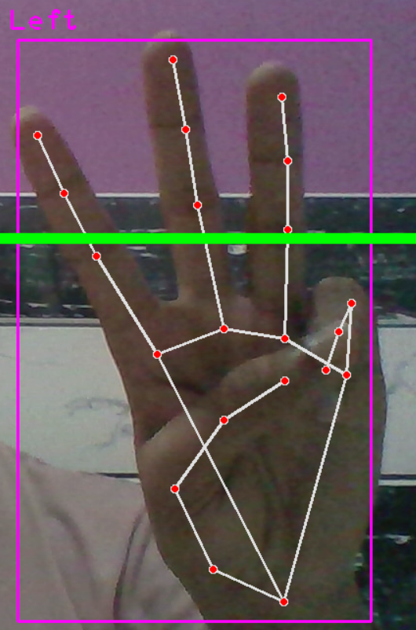

# Gesture_Controlled_Presentation
This project introduces a gesture-controlled presentation system utilizing OpenCV and Mediapipe, providing an innovative, touch-free way to navigate through presentations. By leveraging advanced computer vision and machine learning techniques, users can control their slides using simple hand gestures.

## Features
- **Hand Detection and Tracking**: Real-time detection and tracking of hand movements.
- **Gesture Recognition**: Interpretation of gestures to control presentation actions (e.g., advancing slides, going back, pausing).
- **Software Integration**: Seamless control of popular presentation software like PowerPoint and Google Slides.
- **User Interface**: Displays detected gestures and slide status for user convenience.

## Requirements
- Python 3.7+
- OpenCV
- Mediapipe
- A webcam

## Usage
1. Ensure your webcam is connected.
2. Make a folder containing all your presentation images.

##Gestures
Here are the five gestures used in this project along with their respective images:

1. **Swipe Left**: Move to the next slide
    
2. **Swipe Right**: Return to the previous slide
    
3. **Cursor**: Pause the presentation
    
4. **Draw**: Resume the presentation
    
5. **Eraser**: Exit the presentation
    
